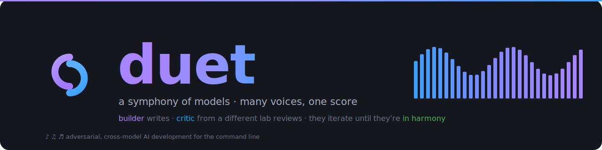
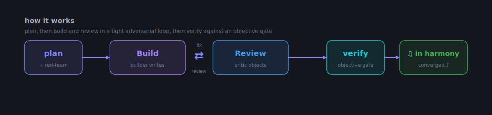
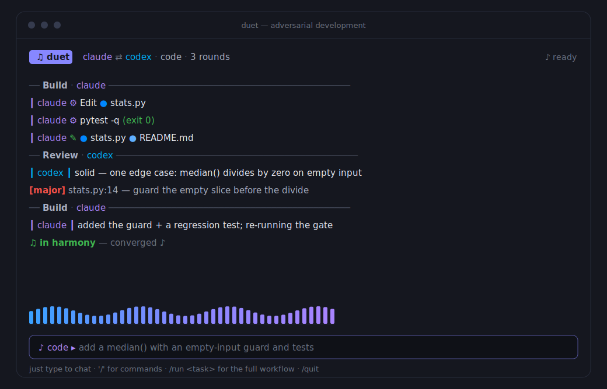

<p align="center">
  
</p>

<p align="center">
  <a href="LICENSE"></a>
  
  
  
</p>

# duet

**adversarial, cross-model AI development for the command line.** one model writes
code, a second model from a *different* vendor reviews it, and the two iterate over a
working tree until the reviewer's objections are resolved or a bounded round limit is
reached.

the premise is narrow and testable. a model that reviews its own output carries the same
blind spots that produced it. a model from a different lineage tends to fail in different
places, so cross-vendor review surfaces defects that single-model self-review does not.
duet pairs Claude Code (🎤 builder) with OpenAI Codex (🎧 critic) by default, and can
route any role — including a third opinion — to a local model served over an
OpenAI-compatible API.

## how it works

<p align="center">
  
</p>

a run moves through fixed phases. the builder drafts a **plan**; the critic **red-teams**
it; the builder **builds**; then **review ⇄ fix** alternate over bounded rounds, always
finishing on a review. convergence is decided by an **objective gate** — a test command, a
citation check, or a harness smoke test — not by a model grading itself. when the gate is
green and the critic has no blocking objections, the ensemble is **🎵 in harmony**.

## built with duet

duet's own Rust source was written this way. each change was drafted by one model and
critiqued by another through the same loop the tool automates, with the adversarial review
run before the change was accepted. the codebase is the tool's first and largest case
study, and its integration tests parse real CLI output captured during that development.

## the interactive shell

running `duet` with no arguments opens a full-screen terminal application — a header, a
scrolling color-guttered conversation, and an input box. plain text is treated as chat;
`/` opens a command palette; `/run <task>` starts the full workflow. each voice speaks in
its own hue, carried down the left of every line.

<p align="center">
  
</p>

## capabilities

- **cross-model adversarial loop.** the builder and critic alternate over bounded rounds
  and always finish on a review. convergence is decided by an objective gate, not by a
  model grading itself.
- **interactive shell.** the full-screen app described above — chat, a `/` command
  palette, and `/run <task>` for the whole plan → build → review ⇄ fix → verify loop.
- **three domains.** `code` runs the build-and-review loop. `research` gathers sources and
  verifies each claim against its citation. `security` builds forensics,
  reverse-engineering, and incident-analysis harnesses under explicit operational-safety
  constraints.
- **three providers.** Claude Code, OpenAI Codex, and any OpenAI-compatible local server
  (LM Studio, Ollama, vLLM, LiteLLM), assignable per role.
- **hardware-aware model selection.** duet probes the host's CPU, GPU, and memory and
  recommends local models that fit, ranked by capability and cost, falling back to cloud
  models when no local option is viable.
- **profiles.** named role-to-model bundles ("ensembles"), defined in the repository and
  overridable per user.
- **deterministic, replayable runs.** every model invocation streams typed JSON events
  into a color-coded transcript that is recorded to disk and can be replayed.

## requirements

- Rust (stable, 2021 edition) to build from source.
- Claude Code (`claude`), authenticated.
- OpenAI Codex CLI (`codex`), authenticated.
- a git repository for the `code` and `security` workflows, which diff the working tree to
  obtain the unit under review.
- optional: a local OpenAI-compatible server for local-model roles, located with
  `DUET_LOCAL_BASE_URL`.

`duet doctor` reports the status of each prerequisite.

## install

```bash
git clone https://github.com/cyberslop/duet.git
cd duet
cargo build --release
ln -s "$PWD/target/release/duet" ~/.local/bin/duet
```

## usage

open the interactive shell from inside a git repository:

```bash
duet
```

plain text chats with the default model. a message that clearly describes a build task
starts a planning session automatically. the `/` key opens the command palette, and
`/run <task>` starts the full plan, build, review, fix, and verify loop.

the same workflows are available non-interactively:

```bash
duet run "add a median() function with an empty-input guard and tests"
duet review
duet run --tui "<task>"
duet run --domain research "How does the Eiffel Tower's height change with temperature?"
duet run --domain security "Build a harness to triage AVML memory captures"
```

### shell commands

| command | description |
|---|---|
| `<text>` | chat with the default model |
| `/run <task>` | full workflow: plan → build → review ⇄ fix → verify |
| `/review [text]`, `/plan <text>` | review only, or plan only |
| `/domain code\|research\|security` | switch domain |
| `/builder claude\|codex`, `/critic claude\|codex\|local` | reassign a role |
| `/profile <name>`, `/profiles` | apply or list ensembles |
| `/rounds <N>`, `/swap`, `/noplan` | tune the loop |
| `/models`, `/doctor`, `/status` | local-model advice, environment check, current setup |

## model selection

duet selects models by capability and cost rather than by whatever happens to be loaded. a
profile bundles a builder, a critic, a round count, and a domain.

```bash
duet profiles
duet run --profile code-local-critic "<task>"
duet suggest-models --domain security
```

the advisor probes the host and recommends local models that fit, falling back to cloud
models when none are viable. built-in profiles are defined in
`crates/duet-cli/src/profiles.toml`. user overrides live in
`~/.config/duet/profiles.toml`, where a matching name takes precedence.

## architecture

a four-crate Cargo workspace with a strict dependency order. `duet-cli` depends on
`duet-agents`, `duet-core`, and `duet-tui`. `duet-agents` depends on `duet-core`.
`duet-core` depends on nothing else in the workspace.

```
duet-core    Engine and abstractions: the typed event model (Claude stream-json
             and Codex --json normalized to one AgentEvent type), the Agent,
             Critic, Domain, and Reporter traits, the phase-and-round orchestrator,
             prompts, the hardware probe, and the model advisor.
duet-agents  Concrete backends: the Claude Code and Codex CLI drivers, the local
             OpenAI-compatible HTTP backend, and the Critic implementations.
duet-tui     The ratatui interfaces: the interactive shell and the run viewer.
duet-cli     The duet binary (clap), which wires backends to the engine.
```

adding a provider is a single `Agent` implementation, plus a `Critic` implementation if it
reviews, in `duet-agents`. adding a workflow is a single `Domain` implementation in
`duet-core`. the engine references only the traits, never a concrete backend.

## configuration

| variable | purpose |
|---|---|
| `CLAUDE_BIN`, `CODEX_BIN` | override CLI discovery |
| `DUET_LOCAL_BASE_URL` | local OpenAI-compatible endpoint (default `http://localhost:1234/v1`) |
| `DUET_LOCAL_MODEL`, `LOCAL_API_KEY` | local model id and API key |
| `DUET_PROFILES` | path to a profiles TOML that overrides the default location |
| `DUET_PROMPTS` | directory of prompt-template overrides |
| `DUET_NO_ICONS` | disable Nerd-Font file icons and use plain glyphs |
| `COLORTERM` | `truecolor` / `24bit` selects exact brand hex; otherwise the TUI falls back to ANSI-256 |
| `NO_COLOR` | disable ANSI color |

## design

duet has a small, deliberate brand: dark, monospace, terminal-first, organized around a
musical **duet** metaphor — two voices, color-guttered, iterating until they're in harmony.
the visual language is documented in [`docs/brand.md`](docs/brand.md), and the marks live
in [`assets/`](assets/) (regenerate the README graphics with `python3 assets/generate.py`).
the redesign that produced the current look — UI, README, and graphics — is written up in
[`docs/REDESIGN.md`](docs/REDESIGN.md).

| color | hex | role |
|---|---|---|
| violet | `#A884FF` | builder voice / primary accent |
| azure | `#3AA0FF` | critic voice / secondary accent |
| periwinkle | `#8787FF` | UI accent — the `♫ duet` badge, input border, palette |
| claude / codex / local | `#AF87FF` / `#00AFFF` / `#00D7D7` | the per-voice gutters |

## development

```bash
cargo test
cargo clippy --all-targets
cargo build --release
```

the event layer is tested offline against real captured CLI streams in
`crates/duet-core/tests/fixtures/`. the terminal interfaces render to a ratatui
`TestBackend`, so layout is verified without a live terminal.

## contributing

see [CONTRIBUTING.md](CONTRIBUTING.md). issues and pull requests are welcome.

## license

MIT. Copyright 2026 CYBERSLOP. See [LICENSE](LICENSE).

---

<p align="center"><sub>♪ ♫ ♬ &nbsp; a symphony of models — many voices, one score &nbsp; ♬ ♫ ♪</sub></p>
